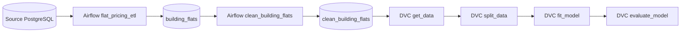

# Real Estate ETL and DVC Training Pipeline

This project builds a reproducible real estate price modeling pipeline: Airflow prepares a clean analytical table, and DVC manages data ingestion, train/test splitting, CatBoost training, and evaluation.

## Overview
- Business context: a real estate marketplace needs a repeatable pipeline for estimating flat prices from building and apartment attributes.
- ML problem type: supervised regression.
- Final deliverable: orchestrated ETL plus a DVC-controlled training pipeline for a CatBoost price model.

## ML Task
- Target variable: `price`.
- Input features: building age/type/location, floor counts, elevator flag, floor, areas, rooms, apartment/studio flags.
- Evaluation metrics: MAE, RMSE, R2, and cross-validation metrics configured in `params.yaml`.
- Assumptions: raw tables `flats` and `buildings` are available through an Airflow PostgreSQL connection.

## Data
Raw data is read from private PostgreSQL tables and is not included. The DVC stage `get_data` exports the cleaned `clean_building_flats` table after database access is configured.

## Solution Architecture


## Repository Structure
```text
.
|-- airflow/
|   |-- dags/
|   |-- plugins/steps/
|   |-- docker-compose.yaml
|   `-- requirements.txt
`-- dvc_pipeline/
    |-- scripts/
    |-- params.yaml
    |-- dvc.yaml
    `-- dvc.lock
```
`airflow/` contains ETL DAGs and optional notifications. `dvc_pipeline/` contains reproducible model training stages.

## Tech Stack
Python, pandas, scikit-learn, CatBoost, Airflow, PostgreSQL, DVC, Docker, S3-compatible object storage.

## How to Run
```bash
cp ../../.env.example .env
cd airflow
docker compose up --build
```
Configure Airflow connections `source_db` and `destination_db`. For DVC:
```bash
cd dvc_pipeline
python -m venv .venv
. .venv/bin/activate
pip install -r ../airflow/requirements.txt
dvc repro
```
Reproduction requires access to the private database and, if enabled, a private DVC remote.

## Pipeline Details
- `flat_pricing_etl.py` joins flat and building source tables and loads `building_flats`.
- `clean_flats.py` deduplicates rows, imputes missing values, and removes IQR outliers.
- `dvc.yaml` defines `get_data`, `split_data`, `fit_model`, and `evaluate_model` stages.
- `params.yaml` centralizes split settings, features, CatBoost parameters, and evaluation metrics.

## Model Evaluation
Metrics are produced by the pipeline after data access is configured; raw data and model artifacts are not committed to this public repository.

## Engineering Highlights
- Airflow ETL with explicit database connections.
- DVC pipeline for reproducible training and evaluation.
- Parameterized model configuration.
- Optional notifications that do not fail when credentials are absent.
- Private data, model binaries, and DVC cache excluded from GitHub.

## Limitations and Next Steps
- Add unit tests around cleaning rules.
- Add data quality checks before loading tables.
- Register trained models in a model registry.
- Add drift checks for price and feature distributions.
