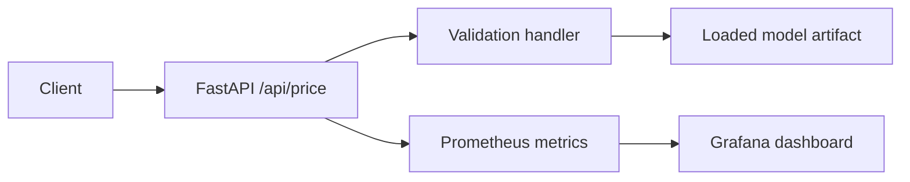

# Real Estate Price API with Monitoring

This project packages a trained real estate price model behind a FastAPI service and exposes operational metrics for Prometheus and Grafana.

## Overview
- Business context: serve real-time price estimates for real estate listings.
- ML problem type: online regression inference.
- Final deliverable: containerized API service with health checks, request validation, and monitoring.

## ML Task
- Target variable: `price`.
- Input features: building and apartment attributes matching the training feature schema.
- Evaluation metrics: model quality metrics are produced upstream; the service tracks latency, errors, request volume, and model-loaded status.
- Assumptions: a trained model file is mounted at `MODEL_PATH`.

## Data
Raw data and the trained model binary are not included. The `services/models/.gitkeep` file marks where a private model artifact can be mounted.

## Solution Architecture


## Repository Structure
```text
.
|-- services/
|   |-- ml_service/
|   |-- models/
|   |-- prometheus/
|   `-- requirements.txt
|-- monitoring/
|-- scripts/
|-- Dockerfile
`-- docker-compose.yaml
```

## Tech Stack
Python, FastAPI, pandas, scikit-learn, CatBoost, joblib, Docker, Prometheus, Grafana.

## How to Run
```bash
cp services/.env.example services/.env
# place the private model at services/models/model.pkl or set MODEL_PATH
docker compose up --build
curl http://127.0.0.1:4648/health
```
To generate traffic for monitoring:
```bash
python scripts/load_generator.py --url http://localhost:4648/api/price/ --total 500 --concurrency 20
```

## Pipeline Details
- `price_app.py` defines the FastAPI app, health check, inference endpoint, and Prometheus metrics.
- `fast_api_handler.py` validates request schemas and maps model errors to structured responses.
- `model_loader.py` loads the private model artifact from `MODEL_PATH`.
- `monitoring/grafana-dashboard.json` can be imported into Grafana.

## Model Evaluation
Metrics are produced by the pipeline after data access is configured; raw data and model artifacts are not committed to this public repository.

## Engineering Highlights
- Containerized inference service.
- Explicit schema validation before prediction.
- Prometheus counters, histograms, and model availability gauge.
- Grafana dashboard and load-test helper.
- Model artifact excluded from GitHub.

## Limitations and Next Steps
- Add contract tests with a tiny synthetic model fixture.
- Add model signature validation at startup.
- Add drift and prediction-distribution monitoring.
- Add deployment manifests for a managed environment.
