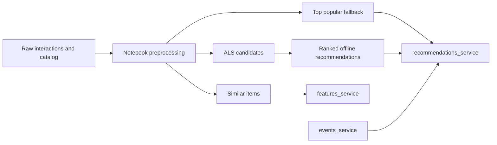

# Music Recommendation Service

This project builds a prototype music recommendation system with offline ranking artifacts and three online services for events, item similarities, and blended recommendations.

## Overview
- Business context: help listeners discover relevant tracks in a large streaming catalog.
- ML problem type: recommender system with implicit feedback and ranking.
- Final deliverable: offline recommendation artifacts plus FastAPI microservices for online recommendation serving.

## ML Task
- Target variable: held-out user-track interactions.
- Input features: listening interactions, track metadata, ALS scores, item popularity, and similarity scores.
- Evaluation metrics: precision@5, recall@5, coverage@100, novelty@5.
- Assumptions: raw catalog and interaction parquet files are available locally or in controlled storage.

## Data
Raw music interaction and catalog data are not included. Generated parquet artifacts in `recsys/data/` and `recsys/recommendations/` are excluded.

## Solution Architecture


## Repository Structure
```text
.
|-- notebooks/
|-- recsys/
|   |-- data/
|   `-- recommendations/
|-- scripts/
|-- services/
`-- requirements.txt
```

## Tech Stack
Python, pandas, NumPy, implicit ALS, CatBoost, FastAPI, requests, parquet.

## How to Run
```bash
python -m venv .venv
. .venv/bin/activate
pip install -r requirements.txt
jupyter lab notebooks/music_recommendations.ipynb
```
After generating private artifacts:
```bash
uvicorn services.features_service:app --host 0.0.0.0 --port 8010
uvicorn services.events_service:app --host 0.0.0.0 --port 8020
uvicorn services.recommendations_service:app --host 0.0.0.0 --port 8000
python scripts/service_smoke.py
```

## Pipeline Details
- The notebook prepares items/events, trains ALS, builds item-to-item similarities, ranks candidates, and writes serving parquet files.
- `events_service.py` stores recent online interactions in memory.
- `features_service.py` serves similar tracks from parquet.
- `recommendations_service.py` blends recent-event recommendations with offline recommendations and a top-popular fallback.

## Model Evaluation
Actual notebook-reported holdout metrics:
| Recommender | precision@5 | recall@5 | coverage@100 | novelty@5 |
| --- | ---: | ---: | ---: | ---: |
| Top popular | 0.0009 | 0.0008 | 0.0001 | 0.9203 |
| Personal ALS | 0.0044 | 0.0077 | 0.0043 | 1.0000 |
| Final ranked | 0.0075 | 0.0121 | 0.0043 | 1.0000 |

## Engineering Highlights
- Offline and online recommendation paths.
- Item-to-item feature service.
- Cold-start fallback to top popular tracks.
- Smoke scenarios for cold and warm users.
- Generated artifacts excluded from GitHub.

## Limitations and Next Steps
- Persist online events outside process memory.
- Add model and artifact versioning.
- Add automated service tests with tiny synthetic parquet fixtures.
- Add monitoring for recommendation latency and fallback rate.
