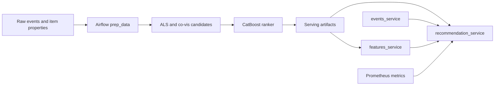

# E-commerce Recommendation Platform

This project builds an end-to-end e-commerce recommendation platform with offline candidate generation, CatBoost ranking, online services, monitoring metrics, MLflow logging, and an Airflow retraining DAG.

## Overview
- Business context: recommend items that users are likely to add to cart.
- ML problem type: recommender system with implicit feedback and learning-to-rank.
- Final deliverable: recommendation services plus an Airflow DAG that rebuilds serving artifacts.

## ML Task
- Target variable: held-out `addtocart` events.
- Input features: event strength, ALS score, co-visitation score, top-popular score, item category signals.
- Evaluation metrics: precision@k, recall@k, NDCG@k, coverage@100.
- Assumptions: raw event and item-property CSV files are available in `data/`.

## Data
Raw CSV files and generated parquet/model artifacts are not included. Expected private inputs:
- `data/events.csv`
- `data/item_properties_part1.csv`
- `data/item_properties_part2.csv`
- `data/category_tree.csv`

## Solution Architecture


## Repository Structure
```text
.
|-- airflow/
|-- data/
|-- models/
|-- notebooks/
|-- scripts/
|-- services/
|-- Dockerfile
|-- Dockerfile.airflow
|-- docker-compose.yml
`-- docker-compose.airflow.yml
```

## Tech Stack
Python, pandas, NumPy, scipy sparse matrices, implicit ALS, CatBoost, MLflow, FastAPI, Prometheus, Airflow, Docker.

## How to Run
```bash
python -m venv .venv
. .venv/bin/activate
pip install -r requirements.txt
jupyter lab notebooks/ecommerce_recommendations.ipynb
```
For services after artifacts are generated:
```bash
docker compose up --build
curl http://127.0.0.1:8000/healthz
```
For retraining:
```bash
docker compose -f docker-compose.airflow.yml up --build
```

## Pipeline Details
- `airflow/dags/retrain_recs.py` prepares events, builds ALS and co-visitation candidates, trains a CatBoost ranker, and writes serving artifacts.
- `services/events_service.py` stores recent user events in memory.
- `services/features_service.py` serves similar items from parquet.
- `services/recommendation_service.py` blends offline and online recommendations and exposes Prometheus metrics.
- `scripts/run_mlflow.sh` starts a local MLflow tracking server.

## Model Evaluation
Actual notebook-reported metrics:
- ALS baseline: precision@5 0.0076, recall@5 0.0153, NDCG@5 0.0135, hit rate 0.0348, recall@20 0.0406, NDCG@20 0.0211, coverage@100 0.0867.
- Co-visitation candidates: precision@5 0.0109, recall@5 0.0289, NDCG@5 0.0248, hit rate 0.0475, recall@20 0.0537, NDCG@20 0.0319, coverage@100 0.4822.
- CatBoost ranker on late-window inference: precision@5 0.0026, recall@5 0.0043, NDCG@5 0.0024, hit rate 0.0130, recall@20 0.0692, NDCG@20 0.0234, coverage@100 0.1106.

## Engineering Highlights
- Candidate generation with ALS, co-visitation, and top-popular fallback.
- CatBoost ranker over multiple candidate-source scores.
- Airflow DAG for scheduled artifact regeneration.
- FastAPI services with Prometheus metrics.
- Raw data and generated artifacts excluded from GitHub.

## Limitations and Next Steps
- Persist online events in Redis or a database.
- Add model registry promotion and artifact version checks.
- Add drift monitoring for event rates and category mix.
- Add small synthetic fixtures for service and DAG tests.
